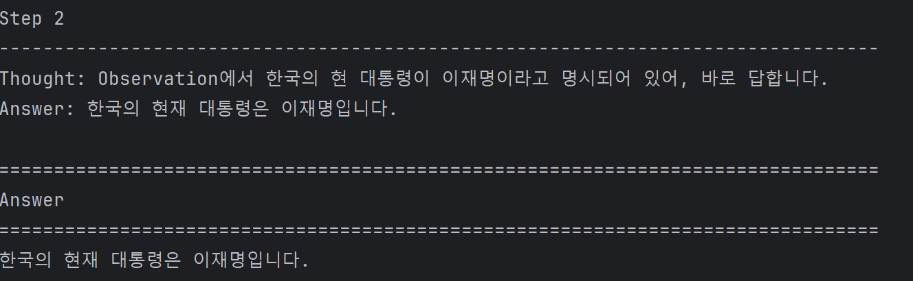

# ReAct Agent

## 실행 방법

필요한 라이브러리 설치:

```bash
pip install openai python-dotenv requests
```

`.env` 파일 설정:

```env
OPENAI_API_KEY=your_openai_api_key
```

프로그램 실행:

```bash
python ReAct-hotpotqa-test.py
```

## 사용한 라이브러리

- openai
- python-dotenv
- requests
- os
- re
- json

## 구현 기능

- ReAct 기본 흐름 구현
- Wikipedia 검색 지원
- 덧셈 계산 지원
- 곱셈 계산 지원
- Action 파싱 지원
- 도구 호출 지원
- 다중 단계 추론 지원

## 실행 결과 이미지

```markdown```


```markdown```


# react_case_reproduce.py
ReAct 논문의 그림 1을 재현하는 데 사용된 네 가지 방법:
1. Standard Prompting
2. Chain-of-Thought Prompting
3. Act-only
4. ReAct

참고:

- 이 코드는 API 키가 필요 없는 최소한의 교육용 버전입니다.

- 이 코드는 논문에 설명된 검색/조회/완료 방법을 시뮬레이션하기 위해 미니 위키피디아 환경을 사용합니다.

- 이 코드는 논문의 모든 실험 지표를 재현하는 것이 아니라 네 가지 방법 간의 동작 차이를 이해하는 데 중점을 둡니다.

## 실행 방법：

``` python react_case_reproduce.py ```
# ReAct-Example.py
llama_index 라이브러리를 사용하여 사례 1의 코드를 재현합다.

**.env** 파일에 Google API 키를 추가하세요. API 키가 없는 경우, https://ai.google.dev/gemini-api/docs/api-key 에서 무료로 발급받을 수 있습니다.

## 실행 방법：

``` python  ReAct-Example.py```


